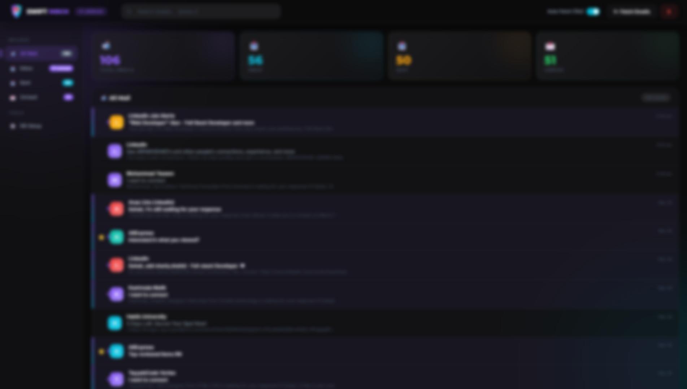

# 🚀 Swift Inbox - Your Ultimate Local Gmail Companion



**Swift Inbox** is a lightning-fast, privacy-first, and beautifully designed local email client. It connects directly to your Gmail account via IMAP, pulls your emails (Inbox & Sent) into a local MySQL database, and serves them to you through a breathtaking, ad-free modern web interface.

## 🎯 Why build this? (The Purpose)

- **Blazing Fast Email Delivery**: Emails load significantly faster here than the native Gmail web interface due to lightweight local database caching.
- **Zero Login Friction**: No more annoying 2-Factor Authentication prompts, IP verifications, or session timeouts. You set it up once, and your emails are always one click away without having to re-authenticate with Google.
- **100% Privacy & Data Ownership**: Your emails are securely fetched and stored on *your* local machine or VPS. No third-party servers scanning your inbox for ads.
- **Offline Access**: Because your emails are stored in a local MySQL database, you can effortlessly browse, read, and search your cached emails even when your internet connection drops.
- **Premium User Experience**: Designed with a stunning 2026-era "Glassmorphism" UI, smooth micro-animations, and a distraction-free, ad-free environment.

---

## 🛠️ Tech Stack
- **Backend:** PHP 8+ (IMAP Extension, MySQLi API)
- **Database:** MySQL / MariaDB
- **Frontend:** HTML5, Vanilla CSS (Glassmorphism & Neu-Brutalism themes), Vanilla JavaScript
- **Environment:** XAMPP (Windows, Mac, Linux compatible)

---

## 👶 Beginner's Setup Guide (No prior experience required!)

Never used XAMPP or PHP before? No problem. Follow these extremely simple steps to get Swift Inbox running on your computer.

### Step 1: Download & Install XAMPP
XAMPP is a free software package that turns your computer into a local web server (giving you PHP and MySQL).
1. Go to [Apache Friends](https://www.apachefriends.org/index.html) and download XAMPP for Windows (or your OS).
2. Install it with the default settings (just keep clicking "Next").
3. Once installed, open the **XAMPP Control Panel**.
4. Click **Start** next to **Apache** and **MySQL**. The text background for both should turn green.

### Step 2: Enable the IMAP Extension
PHP needs a special tool (IMAP) to talk to Gmail. Let's turn it on:
1. In the XAMPP Control Panel, click the **Config** button on the row for **Apache** and select `php.ini`.
2. A Notepad text file will open. Press `Ctrl + F` and search exactly for: `;extension=imap`
3. Remove the semicolon (`;`) at the very start of the line so it looks exactly like this:
   ```ini
   extension=imap
   ```
4. Save the file (`Ctrl + S`) and close Notepad.
5. In the XAMPP Control Panel, click **Stop** then **Start** next to Apache to restart the server and apply the changes.

### Step 3: Get a Gmail "App Password"
Google blocks third-party apps from logging in with your main password. You need a dedicated, secure 16-character password for Swift Inbox.
1. Go to your [Google Account](https://myaccount.google.com/) and click on **Security** in the left menu.
2. Scroll down to the **"How you sign in to Google"** section.
3. **Crucial:** Ensure **2-Step Verification** is turned ON. (Google will not allow you to make app passwords without it).
4. Click on **2-Step Verification**, scroll to the very bottom of the page, and click on **App passwords**.
   *(Alternatively, just type "App passwords" in the top search bar of your Google Account).*
5. In the "App name" field, type **Swift Inbox** and click **Create**.
6. A popup will appear with a 16-character password in a yellow box (e.g., `abcd efgh ijkl mnop`).
7. **Copy this exact password**. You can safely ignore the spaces; we will paste it into your configuration file next. *(Never share this password with anyone!)*

### Step 4: Download & Configure Swift Inbox
1. On GitHub, click the green **Code** button and select **Download ZIP**. Wait for it to download.
2. Extract/Unzip the folder. Rename it to exactly `swift-inbox`.
3. Move the `swift-inbox` folder to your XAMPP web directory. On Windows, this is located at:
   `C:\xampp\htdocs\`
   *(Your final path should look like `C:\xampp\htdocs\swift-inbox`)*
4. Open the `config.php` file inside the project using Notepad or any code editor (like VS Code).
5. Update your credentials at the top of the file:
   ```php
   define('IMAP_USER', 'your.email@gmail.com');
   define('IMAP_PASS', 'abcdefghijklmnop'); // Paste the 16 characters here. NO SPACES!
   ```
6. Save `config.php`.
   > ⚠️ **Important Security Warning:** If you decide to upload this project to your own GitHub, **do not** upload your `config.php` file. Always add it to your `.gitignore` file to protect your email password!

### Step 5: Database Setup & Launch
1. Open your web browser (Chrome, Edge, Safari, etc.) and visit:
   👉 `http://localhost/swift-inbox/db_setup.php`
2. You should see a success message on the screen saying the database and tables are ready.
3. Finally, go to your brand new dashboard:
   👉 `http://localhost/swift-inbox/index.php`
4. Click the **↻ Fetch Emails** button in the top right, or flip on the **Auto Fetch (10s)** toggle. Sit back, and watch your local inbox elegantly populate!

---

## ✨ Core Features
- **Smart Inbox & Sent Sync**: Pulls both incoming and outgoing emails concurrently.
- **10-Second Auto-Fetch Toggle**: Switch on the auto-fetcher to pull new emails seamlessly in the background every 10 seconds.
- **Intelligent Deduplication**: Safely run the fetcher manually or automatically as many times as you want without creating duplicate emails in your database.
- **Bento-Grid Analytics**: Track total emails, unread counts, and mailbox distribution seamlessly at the top of your inbox.
- **Sandboxed HTML Reader**: Read complex HTML emails safely within an isolated iframe, or completely strip all styling with the Plain-Text mode.
- **Offline Capable**: Read, search, and manage your emails without an internet connection.

## 🤝 Contributing
Contributions, issues, and feature requests are welcome! Feel free to check the issues page. If you want to make this project even better, fork the repo and submit a Pull Request!

---
*Created with ❤️ for developers and email power users.*
